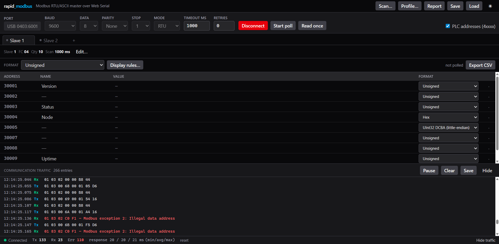

# rapid_modbus

A browser-based **Modbus RTU/ASCII master** for commissioning Modbus devices in the field.
Runs entirely in the browser over the [Web Serial API](https://developer.mozilla.org/en-US/docs/Web/API/Web_Serial_API) — no installation, no license, no backend.

Inspired by [Modbus Poll](https://www.modbustools.com/), rebuilt for the reality of field work:
customer laptops with locked-down admin rights, no internet in the plant room, and a datasheet
nobody can find.

> **Status: working against real hardware.** 231 unit tests, plus a verified live session
> against an FTDI USB-serial adapter — see [Verification](#verification).



*Polling a live device: FC 04 reading ten input registers at 9600 8-N-1, 89 transactions with
zero errors, response times tight at 38–40 ms. The traffic pane shows the actual frames.*

## Serial only — no TCP

**rapid_modbus cannot speak Modbus TCP or UDP, and never will without a backend.**

Browsers cannot open raw TCP/UDP sockets. `fetch` and WebSocket are application-layer
protocols and cannot carry Modbus TCP. The Direct Sockets API is restricted to Isolated Web
Apps, not ordinary web pages. Supporting TCP would require a local WebSocket↔TCP bridge —
that is a backend, and it is out of scope for this project.

If you need Modbus TCP, use a different tool.

## Requirements

| | |
|---|---|
| **Browser** | Chrome, Edge or Opera 89+ on Windows, macOS, Linux or ChromeOS. Chrome 148+ on Android (limited devices). **Safari and Firefox do not support Web Serial.** |
| **Context** | HTTPS or `localhost` — Web Serial requires a secure context |
| **Hardware** | A USB-to-RS485 adapter with **automatic direction control** |

## Works offline

rapid_modbus is a PWA that precaches everything it needs. Open it once with internet, then
install it from the browser's address bar — after that it runs with no network at all.

This is not a nicety. Plant rooms, substations and switchgear cabinets rarely have usable
internet, and a diagnostic tool that needs a connection to start is a tool you cannot use where
you actually need it.

Updates are opt-in: a prompt appears when a new version is cached, because reloading drops the
serial connection and nobody wants that to happen unannounced mid-commissioning.

### About the RS-485 adapter

rapid_modbus does not drive RTS, DTR or any other control signal. JavaScript cannot toggle
RTS fast enough to steer an RS-485 transceiver between bytes, so half-duplex direction
switching must be handled in hardware.

Practically every modern USB-RS485 adapter does this automatically. If yours needs manual RTS
control, it will not work here.

## Development

```bash
npm install
npm run dev
```

| Script | What it does |
|---|---|
| `npm run dev` | Start the dev server (`localhost`, so Web Serial works) |
| `npm run build` | Typecheck and build to `dist/` |
| `npm run preview` | Serve the production build — the only way to exercise the service worker |
| `npm test` | Run the test suite |
| `npm run lint` | Lint with oxlint |
| `npm run icons` | Regenerate the PWA icon set from geometry |

The service worker is disabled in `npm run dev` so it cannot serve stale code while you work.
Use `npm run build && npm run preview` to test offline behaviour.

### Deployment

Pushing to `main` builds and publishes to GitHub Pages via
[`.github/workflows/deploy.yml`](.github/workflows/deploy.yml). The workflow lints, tests and
builds before it deploys, so a red test suite never reaches the field.

The workflow enables Pages through the API on its first run. If your organisation blocks that,
set **Settings → Pages → Source** to **GitHub Actions** by hand and re-run.

## Architecture

The protocol layer is pure TypeScript with **zero browser dependencies**, so every framing and
encoding decision is unit-testable without hardware attached. This is where the painful bugs
live — a wrong CRC or a swapped word order looks like a wiring fault and costs hours on site.

```
src/protocol/     Pure TypeScript, no browser APIs
  crc16.ts          CRC-16/MODBUS
  lrc.ts            LRC for ASCII mode
  pdu.ts            Request builders and response parsers (FC 01-06, 15, 16)
  aduRtu.ts         RTU framing
  aduAscii.ts       ASCII framing
  expectedLength.ts Response length derivation (see below)
  formats.ts        The 29 display formats
  errors.ts         Exception codes and transport errors, with field hints

src/transport/    The byte layer
  link.ts           SerialLink interface — the seam that keeps everything testable
  framer.ts         Byte stream back into frames
  webSerial.ts      The only file that touches navigator.serial

src/core/         The engine
  request.ts        One shape of "thing to send", shared by every caller
  master.ts         Serialised transactions, timeout, retry, traffic events
  scheduler.ts      Round-robin polling across definitions
  scanner.ts        Slave scan, address scan, auto-detect

src/lib/          Pure helpers, all unit tested
  plcAddress.ts     4xxxx notation <-> base-0 protocol addresses
  rows.ts           Response values into grid rows: wide formats, scaling, colours
  profile.ts        Device profiles — JSON and CSV register maps
  workspace.ts      Save/load, with validation and v1 migration on import
  report.ts         Diagnostic report
  csv.ts            CSV export and in-browser downloads
  persistence.ts    IndexedDB autosave

src/store/        Zustand state and the actions that drive the engine
src/ui/           React components

src/testing/      Test-only; nothing in the app imports it
  fakeLink.ts       A simulated Modbus line with misbehaving devices
```

Everything above `webSerial.ts` runs against a fake link, so the polling engine is tested
without a browser or a device attached — including the cases that matter in the field: a reply
delivered one byte at a time, a corrupted checksum, a device that answers only with exceptions,
and a late reply arriving after the master gave up.

### Why response length, not t3.5 timing

Web Serial delivers bytes in arbitrary chunks — chunk boundaries are not frame boundaries —
and JavaScript timers are far too coarse to detect the 3.5-character silent interval that RTU
framing nominally relies on.

Since we are always the master, we know what we asked for. `expectedLength.ts` derives the
exact response length from the first two or three bytes:

| Case | Total frame length |
|---|---|
| Exception (function code has bit 0x80 set) | 5 bytes |
| FC 01–04 | `3 + byteCount + 2` |
| FC 05, 06, 15, 16 | 8 bytes |

The t3.5 timer is kept only as a fallback for flushing garbage off the line.

### The 29 display formats

5 native 16-bit renderings (Signed, Unsigned, Hex, ASCII, Binary), plus 6 wide types (Int32,
UInt32, Int64, UInt64, Float32, Float64) in each of 4 word/byte orders:

| Order | Byte layout | Also known as |
|---|---|---|
| `ABCD` | A B C D | big-endian |
| `BADC` | B A D C | big-endian, byte swap |
| `CDAB` | C D A B | little-endian, byte swap (word swap) |
| `DCBA` | D C B A | little-endian |

Word order is the single most common reason a float reads as garbage in the field, so all four
are first-class and switchable per cell.

## Device profiles

A register map for a device model — name, format, scaling and unit per address. Import it once
and the grid reads **Voltage L1 231.4 V** instead of `40001 2314`.

The same meter, drive or controller gets commissioned over and over, so this compounds. Profiles
are plain files you can email to a colleague or keep next to the drawings.

```csv
plc_address,name,format,factor,offset,unit
40001,Voltage L1,float32_CDAB,,,V
40003,Current L1,uint16,0.01,,A
40005,Status,uint16,,,
```

Column order and header case do not matter. Addresses may be base-0 (`address`) or datasheet
notation (`plc_address`) — the header has to say which, because guessing between the two would
silently read the wrong register. JSON profiles additionally carry the block layout, so
importing one recreates the whole definition rather than mapping onto the current tab.

Registers that fall outside the current range are **reported, not dropped** — silently applying
half a profile is how people end up reading the wrong block and not noticing.

## Reading a panel, not decoding one

| Feature | What it does |
|---|---|
| **Scaling** | `engineering = factor × raw + offset`, with a live preview so a wrong factor is obvious before it is applied |
| **Units** | Appended to the value: `231.4 V` |
| **Value names** | Replaces a raw value with a label — `0 = Off`, `1 = Run`, `2 = Fault` |
| **Conditional colours** | Colours a cell when it falls in a band; first matching rule wins, so ordering expresses precedence |
| **Diagnostic report** | One text file with the serial settings, totals, every value and the full hex log — for emailing back to the office |

Writes respect scaling in both directions: type the engineering value, and the dialog shows the
raw words it will unscale to before anything goes on the wire.

## Roadmap

- [x] Protocol layer + tests
- [x] Web Serial transport and frame reader
- [x] Polling engine (round-robin across definitions)
- [x] Slave ID scan / address scan / auto-detect wizard
- [x] Grid UI, write dialog, communication traffic monitor
- [x] Workspace save/load + IndexedDB autosave
- [x] PWA offline support + GitHub Pages deployment
- [x] Scaling, units, conditional colours, value names
- [x] Device profiles (importable register maps)
- [x] Diagnostic report export

See [docs/REQUIREMENTS.md](docs/REQUIREMENTS.md) for the full specification.

## Verification

### Against real hardware

The screenshot above is a live session through an FTDI FT232R (USB `0403:6001`) at 9600 8-N-1,
reading ten input registers with function 04. Every frame in the traffic pane decodes correctly:

```
Tx  01 04 00 00 00 0A 70 0D
    slave 01 · FC 04 · start 0x0000 · quantity 0x000A (10) · CRC

Rx  01 04 14 03 00 00 0A 77 CD 00 02 00 02 00 00 00 03 00 00 00 90 00 00 A2 44
    slave 01 · FC 04 · byte count 0x14 (20 = 10 registers) · 20 data bytes · CRC
```

Checked against what the grid rendered:

| Address | Registers | Format | Shown |
|---|---|---|---|
| 30002 | `000A` | Unsigned | `10` |
| 30003 | `77CD` | Unsigned | `30669` |
| 30004 | `0002` | Hex | `0002` |
| 30005 | `0002 0000` | UInt32 DCBA | `512` |
| 30009 | `0090` | Unsigned | `144` |

The UInt32 row is the interesting one: bytes `00 02 00 00` reversed for DCBA give `00 00 02 00`
= 512. Word-order handling is correct end to end, on real bytes from a real device.

89 transactions, **zero errors**, and a 38–40 ms min/max spread. A tight spread matters more
than the absolute number — it means the length-driven framer is reading whole frames cleanly
rather than scraping through timeouts.

### Against a simulated line

Everything above `webSerial.ts` is covered by 231 tests running against
`src/testing/fakeLink.ts`, which misbehaves on purpose: silence, corrupted checksums,
exception-only devices, and replies dribbled out one byte at a time.

### Still untested

One confirmed working setup is not the same as a proven tool. Not yet exercised: Modbus ASCII
mode, writes to a live device, the auto-detect sweep against real hardware, baud rates other
than 9600, long RS-485 runs where termination and biasing start to matter, and devices that
play loose with the spec.

## License

[MIT](LICENSE)
